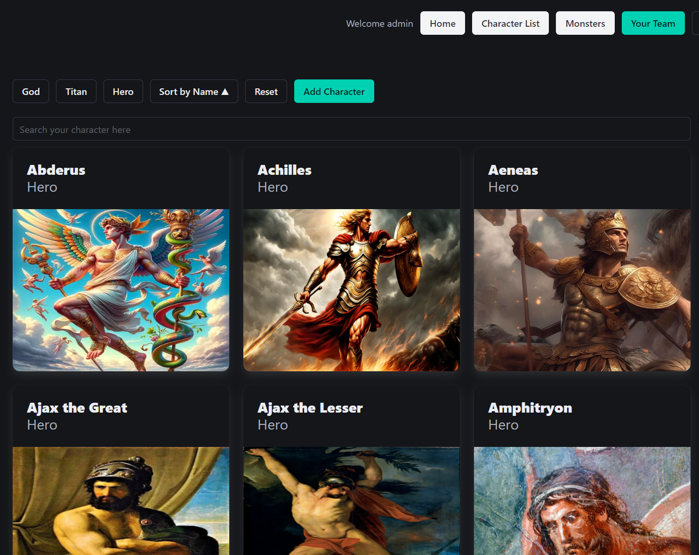
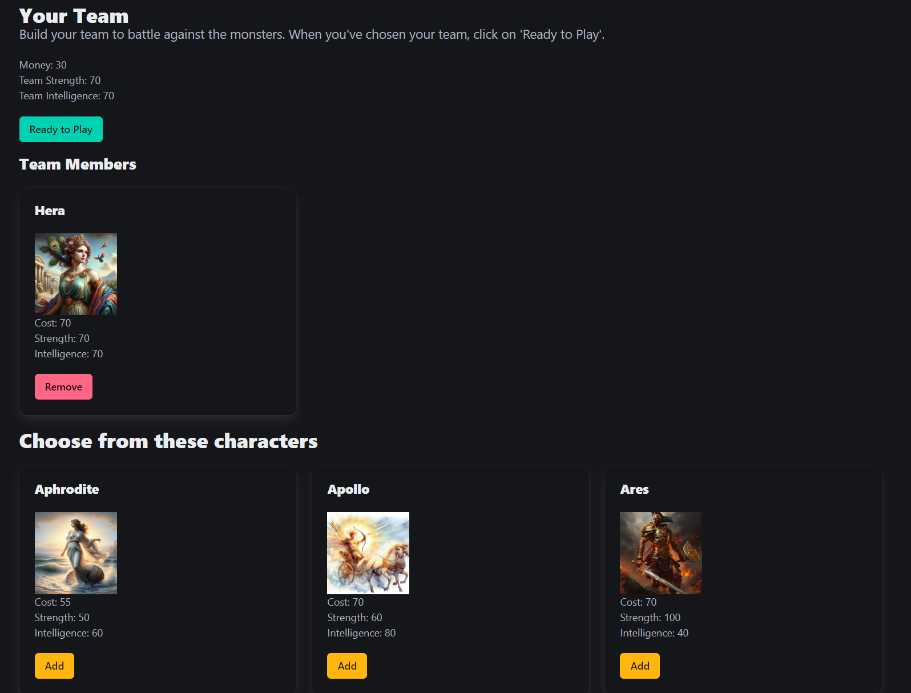
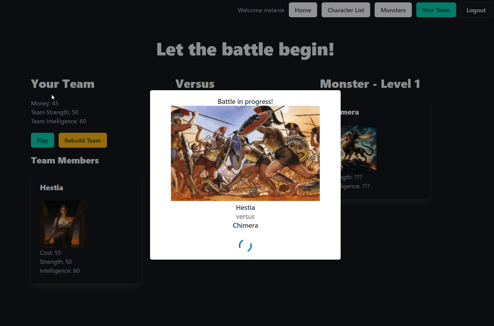

# Project 3 - Mythopedia

## Overview

For the third project of the General Assembly Software Engineering Course, the requirement was to make a MongoDB/Express/React/Node application with full CRUD functionality. This was the first pair project of the course. 

We are both interested in Greek mythology which inspired us to create the application, Mythopedia.

## Description of the Application

Any user of the website can view the home page which briefly introduces the site and the 'Character List' which contains cards for each Greek mythological character in our database. Each card is a link to an individual show page for the character which has further information about that character including links to other characters they are related to.

A user also has the option to create an account. The user starts with money of 100 and can buy gods to be part of their team. Each god has a strength and an intelligence stat. The user can then battle against monsters, there are 5 level of monsters with increasing stats. Once the user has won all 5 levels, they can reset the stats. The user's gameplay data is saved to the database so the user's team and progress is not lost if the user navigates to a different page or logs out.

## Deployed Application

[Link to the deployed version here](https://mythopedia-f-by-k-m.netlify.app/) 

## Application Setup 

**Front-end and back-end**

The application uses separate repositories for the front-end and the back-end - [link to the back-end repository](https://mythopedia-by-k-m.netlify.app/).

- The front-end is built with React and uses axios requests to talk to the back-end.

- The back-end is built with Express and Node and uses mongoose to talk to the MongoDB database management system.

- The back-end and front-end use JWT token-based authentication to sign in and out users.

**Schemas**

We created four mongoose schemas: User, Game, Character and Monster. The Game schema is embedded in the User schema and it references the Character schema.

```JS
const gameSchema = new mongoose.Schema({
    level: { type: Number, require: true, default: 1},
    money: { type: Number, require: true, default: 100 },
    totalStrength: { type: Number, require: true, default: 0 },
    totalIntelligence: { type: Number, require: true, default: 0 },
    team: [{ type: mongoose.Schema.Types.ObjectId, ref: 'Character' }]
})

const userSchema = new mongoose.Schema({
    username: { type: String, require: true, unique: true },
    email: { type: String, require: true, unique: true },
    password: { type: String, require: true },
    isAdmin: { type: Boolean, default: false },
    gameplay: { type: gameSchema, require: true, default: {level:1 ,money: 100, strength: 0, intelligence: 0} }
})

const characterSchema = new mongoose.Schema({
    name: { type: String, require: true, unique: true },
    description: { type: String, require: true },
    type: { type: String, require: true },
    images: { type: Object, require: true },
    relatives: { type: Object },
    strength: { type: Number, require: true, default: 0 },
    intelligence: { type: Number, require: true, default: 0  },
    cost: { type: Number, require: true, default: 0  },
    isPlayable: { type: Boolean, require: true, default: false }
})

const monsterSchema = new mongoose.Schema({
    name: { type: String, require: true, unique: true },
    description: { type: String, require: true },
    image: { type: String, require: true },
    strength: { type: Number, require: true},
    intelligence: { type: Number, require: true},
    level: { type: Number, require: true }
})
```

**CRUD**

The application has full CRUD fuctionality to enable users to:

- Create a new account, sign in and sign out 
- Add and delete characters from their team
- The admin user can add, edit and delete characters and monsters

**In-app Game**

The game was the most challenging part of setting up the application. It required making requests to the database whenever a user makes changes to their team, or wins a battle so that the data is stored in the Game schema and can then be fetched back from the database to display on the page. The game also fetches and displays the correct monster based on the level of the user.

**UI/UX**

For the design and layout of the application we used the CSS framework, Bulma. 

There is a Navbar with links to all pages for ease of user navigation. On the character and monster pages we also added a search bar and filtering options to improve user experience.

We used a React component called sweetalert2 to display an exciting overlay during the game.

## Displays from the Application

Home page


Character page


Your Team page


Game page


## Technologies Used

**Stack**
- MongoDB
- Express JS
- React
- Node.js

**Languages**
- JavaScript
- HTML
- CSS

## Attributions

- Homepage image from [grunge.com](https://www.grunge.com/img/gallery/the-untold-truth-of-the-temple-of-artemis/intro-1632322815.jpg)
- Character images from [greekmythology.com](https://www.greekmythology.com/) and [wikipedia](https://en.wikipedia.org/wiki/)

## Future Improvements

- Improve game functionality e.g. make it more challenging and add more levels.

## Reflections

This was our first group project - for the first few days of the project we pair coded but after the basic functionality of the application was set up, we each worked on separate parts of the application. 

It was fun to work together and discuss ideas (and also issues!) and it felt less intense than a solo project as the workload was spread. 

## Collaborators

- Kamla
- Melanie